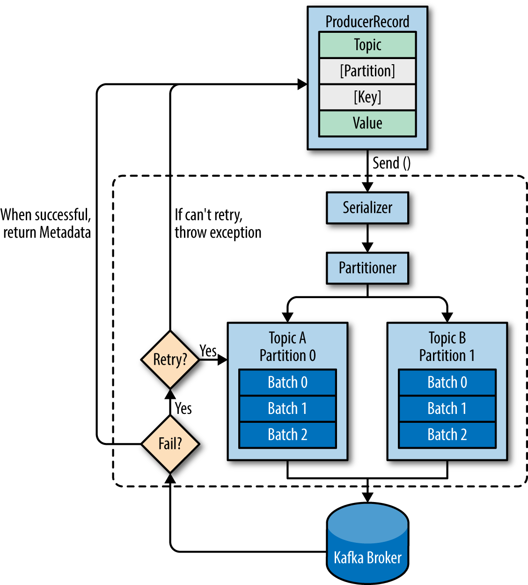

# CSW Tech Unit Kafka (Producer)

## Pre-Requirements


#### 1 - Docker run (Kafka+Zookeper)


```bash
docker run -p 2181:2181 -p 9092:9092 --env ADVERTISED_HOST=127.0.0.1 --env ADVERTISED_PORT=9092 spotify/kafka
```

#### 2 - Java enviroment
https://www.oracle.com/technetwork/java/javase/downloads/jre8-downloads-2133155.html

#### 3 - Create Topics
> Use the kafka-topics.bat file to create:
```bash
kafka-topics.bat --create --bootstrap-server localhost:9092 --replication-factor 1 --partitions 1 --topic csw-topic
kafka-topics.bat --create --bootstrap-server localhost:9092 --replication-factor 1 --partitions 1 --topic csw-topic-portugal
kafka-topics.bat --create --bootstrap-server localhost:9092 --replication-factor 1 --partitions 1 --topic csw-topic-espanha

```

## How Kafka Works

#### Kafka 
Distributed streaming platform

#### Kafka Broker
Typically consists of multiple brokers to maintain load balance. Kafka brokers are stateless, so they use ZooKeeper for maintaining their cluster state.

#### Kafka Cluster 
Multiple kafka brokers 
2 brokers inside the same machine = Cluster size 2

#### Zookeeper 
Centralized service for maintaining metadata about a cluster of distributed nodes
ZooKeeper service is mainly used to notify producer and consumer about the presence of any new broker in the Kafka system or failure of the broker in the Kafka system. 

#### Kafka Topics
Category of messages.

Topics in Kafka are always multi-subscriber; that is, a topic can have zero, one, or many consumers that subscribe to the data written to it.


#### Producers
Producers publish data to the topics of their choice. 


    First get metadata 
    Then Send Message

#### Message Offset
Like a bookmark
  
    Last read message position
    Maintened by kafka consumer

#### Consumers
Consumer instances can be in separate processes or on separate machines.

>If all the consumer instances have the same consumer group, then the records will effectively be load balanced over the consumer instances.

If all the consumer instances have different consumer groups, then each record will be broadcast to all the consumer processes.


###### How does Kafka scale consumers?
>Kafka scales consumers by partition such that each consumer gets its share of partitions. 
>A consumer can have more than one partition, but a partition can only be used by one consumer in a consumer group at a time. If you only have one partition, then you can only have one consumer.

###### What are leaders? Followers?
>Leaders perform all reads and writes to a particular topic partition. Followers replicate leaders.


### Links
* https://bitbucket.critical.pt/projects/ALCHEMISTSTRAINING/repos/techunits/browse/techunits/kafka.md
* http://cloudurable.com/blog/kafka-architecture-topics/index.html
* https://www.tutorialspoint.com/apache_kafka/apache_kafka_cluster_architecture.htm
* https://kafka.apache.org/intro